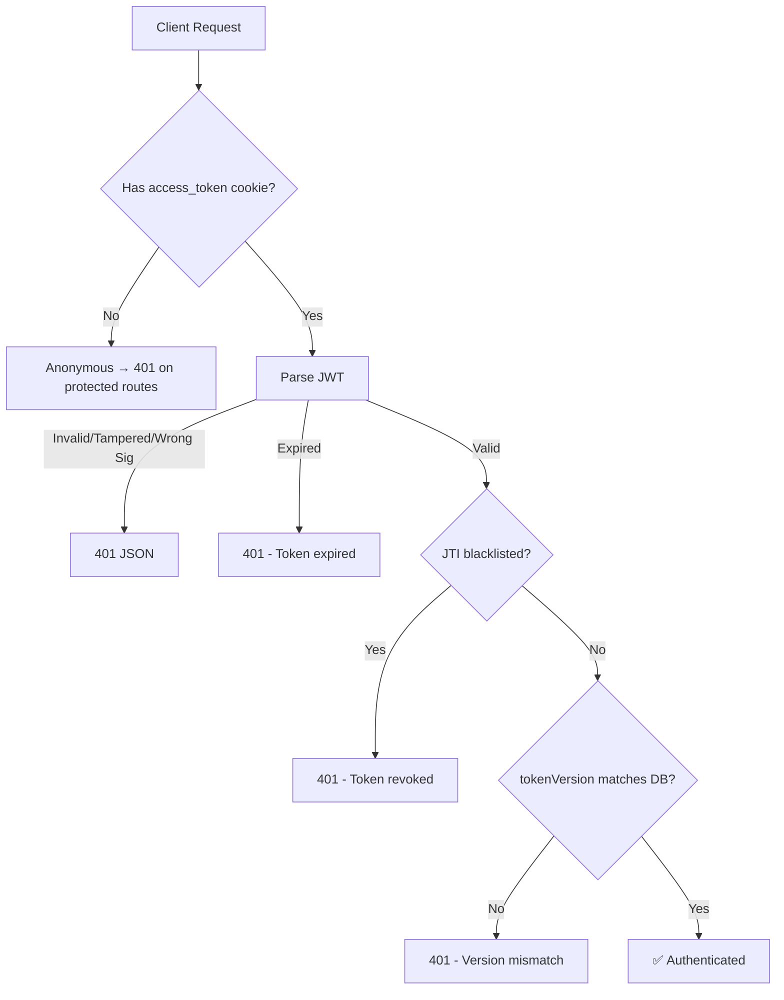

# Walkthrough: Production-Grade Logout

## Architecture



## Files Created (7 new)

| File | Purpose |
|------|---------|
| [RefreshToken.java](file:///c:/Users/manis/Documents/infosys/medsyncpro-backend/src/main/java/com/medsyncpro/entity/RefreshToken.java) | Per-device refresh token entity |
| [BlacklistedToken.java](file:///c:/Users/manis/Documents/infosys/medsyncpro-backend/src/main/java/com/medsyncpro/entity/BlacklistedToken.java) | Revoked access token JTI store |
| [RefreshTokenRepository.java](file:///c:/Users/manis/Documents/infosys/medsyncpro-backend/src/main/java/com/medsyncpro/repository/RefreshTokenRepository.java) | Refresh token DB operations |
| [BlacklistedTokenRepository.java](file:///c:/Users/manis/Documents/infosys/medsyncpro-backend/src/main/java/com/medsyncpro/repository/BlacklistedTokenRepository.java) | Blacklist DB operations |
| [TokenBlacklistService.java](file:///c:/Users/manis/Documents/infosys/medsyncpro-backend/src/main/java/com/medsyncpro/service/TokenBlacklistService.java) | Blacklist + hourly cleanup |
| [RefreshTokenService.java](file:///c:/Users/manis/Documents/infosys/medsyncpro-backend/src/main/java/com/medsyncpro/service/RefreshTokenService.java) | Create, verify, rotate, revoke tokens |

## Files Modified (8)

| File | What Changed |
|------|-------------|
| [User.java](file:///c:/Users/manis/Documents/infosys/medsyncpro-backend/src/main/java/com/medsyncpro/entity/User.java) | Added `tokenVersion` field |
| [JwtService.java](file:///c:/Users/manis/Documents/infosys/medsyncpro-backend/src/main/java/com/medsyncpro/service/JwtService.java) | Overhauled — JTI, tokenVersion, deviceInfo, short expiry |
| [UserService.java](file:///c:/Users/manis/Documents/infosys/medsyncpro-backend/src/main/java/com/medsyncpro/service/UserService.java) | Added [incrementTokenVersion()](file:///c:/Users/manis/Documents/infosys/medsyncpro-backend/src/main/java/com/medsyncpro/service/UserService.java#109-114) |
| [JwtAuthenticationFilter.java](file:///c:/Users/manis/Documents/infosys/medsyncpro-backend/src/main/java/com/medsyncpro/filter/JwtAuthenticationFilter.java) | 4-layer validation with 401 JSON |
| [AuthController.java](file:///c:/Users/manis/Documents/infosys/medsyncpro-backend/src/main/java/com/medsyncpro/controller/AuthController.java) | Login, refresh, logout, logout-all |
| [application.properties](file:///c:/Users/manis/Documents/infosys/medsyncpro-backend/src/main/resources/application.properties) | Split to access (15m) + refresh (7d) |
| [GlobalExceptionHandler.java](file:///c:/Users/manis/Documents/infosys/medsyncpro-backend/src/main/java/com/medsyncpro/exception/GlobalExceptionHandler.java) | JWT exception handlers |
| [MedsyncproApplication.java](file:///c:/Users/manis/Documents/infosys/medsyncpro-backend/src/main/java/com/medsyncpro/MedsyncproApplication.java) | `@EnableScheduling` |

## Verification
- ✅ `mvn compile` — **passed** (exit code 0)

---

## cURL Commands for Postman Testing

> Replace `http://localhost:8080` with your actual server URL.

### 1. Login (sets `access_token` + `refresh_token` cookies)

```bash
curl -v -X POST http://localhost:8080/api/auth/login \
  -H "Content-Type: application/json" \
  -H "User-Agent: PostmanDesktop/1.0" \
  -c cookies.txt \
  -d '{"email":"test@example.com","password":"Password123"}'
```

### 2. Access Protected Endpoint (with cookies)

```bash
curl -v http://localhost:8080/api/users/profile \
  -b cookies.txt
```

### 3. Refresh Token (rotate tokens)

```bash
curl -v -X POST http://localhost:8080/api/auth/refresh \
  -b cookies.txt \
  -c cookies.txt
```

### 4. Logout Current Device

```bash
curl -v -X POST http://localhost:8080/api/auth/logout \
  -b cookies.txt \
  -c cookies.txt
```

### 5. Try Accessing After Logout (should get 401)

```bash
curl -v http://localhost:8080/api/users/profile \
  -b cookies.txt
```

### 6. Logout All Devices

```bash
# Login first
curl -v -X POST http://localhost:8080/api/auth/login \
  -H "Content-Type: application/json" \
  -H "User-Agent: PostmanDesktop/1.0" \
  -c cookies.txt \
  -d '{"email":"test@example.com","password":"Password123"}'

# Logout all
curl -v -X POST http://localhost:8080/api/auth/logout-all \
  -b cookies.txt \
  -c cookies.txt
```

### 7. Already Logged Out (idempotent — should return 200)

```bash
curl -v -X POST http://localhost:8080/api/auth/logout
```

### 8. Invalid/Random Token

```bash
curl -v http://localhost:8080/api/users/profile \
  -H "Cookie: access_token=this.is.not.a.valid.jwt"
```

### 9. Tampered Token

```bash
# Take a valid token, change one character in the payload
curl -v http://localhost:8080/api/users/profile \
  -H "Cookie: access_token=eyJhbGciOiJIUzI1NiJ9.TAMPERED.invalid"
```

### 10. Missing Cookie

```bash
curl -v http://localhost:8080/api/users/profile
```

### 11. Multi-Device Test (login from two devices, logout one)

```bash
# Login from "mobile"
curl -v -X POST http://localhost:8080/api/auth/login \
  -H "Content-Type: application/json" \
  -H "User-Agent: MobileApp/2.0 (iPhone)" \
  -c mobile_cookies.txt \
  -d '{"email":"test@example.com","password":"Password123"}'

# Login from "web"
curl -v -X POST http://localhost:8080/api/auth/login \
  -H "Content-Type: application/json" \
  -H "User-Agent: Mozilla/5.0 (Windows NT 10.0)" \
  -c web_cookies.txt \
  -d '{"email":"test@example.com","password":"Password123"}'

# Logout mobile only
curl -v -X POST http://localhost:8080/api/auth/logout \
  -b mobile_cookies.txt

# Web should still work
curl -v http://localhost:8080/api/users/profile \
  -b web_cookies.txt

# Mobile should fail (401)
curl -v http://localhost:8080/api/users/profile \
  -b mobile_cookies.txt
```

### 12. Expired Refresh Token (wait for expiry or set short expiry in properties)

```bash
curl -v -X POST http://localhost:8080/api/auth/refresh \
  -H "Cookie: refresh_token=expired-or-invalid-uuid"
```

---

### Postman Setup Tips

1. **Import cookies**: In Postman, cookies are managed automatically when using the same domain
2. **Set User-Agent**: Go to Headers tab → add `User-Agent` header with values like `PostmanMobile`, `PostmanWeb`, `PostmanTablet` to simulate different devices
3. **Check cookies**: Use Postman's cookie manager (bottom-left cookies icon) to see `access_token` and `refresh_token` values after login
4. **Disable auto-redirect**: Settings → disable "Follow redirects" to see raw responses
